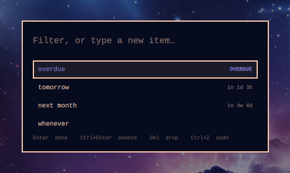
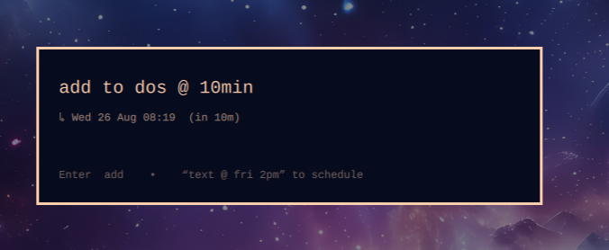
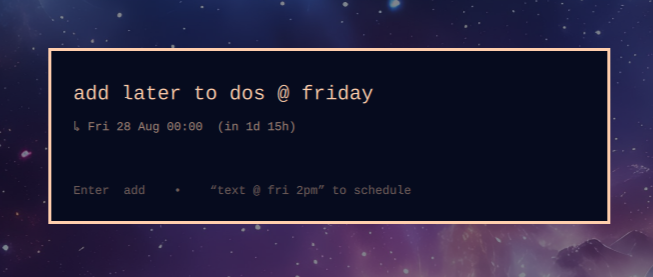
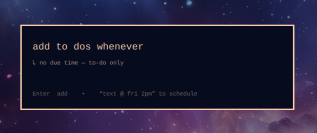

# Reminder Tracker

A persistent to-do list for [Omarchy](https://omarchy.org/) that also notifies.

Omarchy's built-in `omarchy reminder` stores reminders as *transient* systemd
timers under `$XDG_RUNTIME_DIR`. They do not survive a reboot or a logout, and
they evaporate the moment they fire. That is the right design for a kitchen
timer and the wrong one for anything you actually need to remember.

This is the same idea with the storage fixed, plus the thing that falls out of
fixing it for free: a to-do list.



## The model

One record type: an **item** with an optional **due time**.

| | |
|---|---|
| no due time | a plain to-do — sits on the list until you deal with it |
| a due time | notifies once, then *stays on the list* |

**Firing never completes an item.** Only `rem done` or `rem rm` takes something
off the list. A notification you missed while in a meeting is a nudge you
missed, not a task that silently disappeared.

## Install

```bash
omarchy plugin add https://github.com/gumbledore/omarchy-reminder-tracker.git --enable
~/.config/omarchy/plugins/gumbledore.reminders/install.sh
```

The plugin ships the QML surfaces; `install.sh` links the `rem` CLI onto your
PATH and enables the sweeper timer that actually fires reminders. Both are
symlinked back into the cloned repo, so `omarchy plugin update` updates
everything together.

Then bind a key in `~/.config/hypr/bindings.lua`:

```lua
o.bind("SUPER + SHIFT + T", "Reminders", "rem show-overlay")
```

This coexists with the built-in reminders plugin. If you want it to *replace*
that one, disable the stock plugin yourself:

```bash
omarchy plugin disable omarchy.reminders
```

**Requires:** Omarchy with the Quickshell-based shell, plus `jq` and GNU
`date` (both already present on Arch).

## Using it

`SUPER+SHIFT+T` opens the list. The filter line is also the new-item field, so
searching and adding are the same gesture — type to narrow the list, and if
nothing matches, Enter creates what you typed instead.

Items sort the way you actually triage: **overdue first**, then by how soon
they are due, then undated to-dos at the bottom.

| key | |
|---|---|
| `↑` `↓` | move the selection |
| `Enter` | complete the selected item (archived, undoable) |
| `Ctrl+Enter` | snooze it — prompts for a duration |
| `Del` | drop it |
| `Ctrl+Z` | undo the last completion |
| `Esc` | clear the filter, then close |

### In the bar


The bar widget shows how many items are open, and turns the urgent colour when
any of them are overdue. Click it to open the list.

This matters because of the central decision: firing never completes an item,
so a reminder you ignored has to keep nagging from *somewhere*. The
notification is a one-shot nudge you are allowed to miss; the bar count is the
thing that stays.

<br clear="all">

### Scheduling

Everything after ` @ ` goes verbatim to GNU `date -d`, so you can write what
you mean:

```
Call the clinic @ fri 2pm
Renew the domain @ 2 weeks
Standup @ tomorrow 9am
Book flights @ next tuesday 14:00
Pay the invoice @ sep 3
Clear the desk                     <- no "@" at all: a to-do, never fires
```

The overlay resolves the expression **live as you type**, so you commit to a
real timestamp rather than to your guess about how `date` will read it:



That is worth more than it sounds:



`@ friday` is not wrong, but it means *Friday at 00:00* — `date -d` defaults to
midnight when you give it a day and no time. Write `@ friday 2pm` if you meant
the afternoon. The preview exists so you learn that before you commit, rather
than at midnight.

Leave the `@` off entirely and you get a to-do with no due time, which never
notifies and sits on the list until you deal with it:



### CLI

```bash
rem                             # list open items
rem add "Call the clinic @ fri 2pm"
rem add "Clear the desk"        # no "@" -> a to-do with no due time
rem 15 "Tea"                    # bare minutes, like `omarchy reminder`
rem done 3                      # complete (archived, undoable)
rem snooze 3 2h                 # push the due time out
rem rm 3                        # drop
rem undo                        # restore the most recently closed item
rem show                        # the list, as a notification
rem ls --json                   # machine-readable
```

## How it holds up

Four decisions do most of the work, and they are the parts worth knowing about
before you trust this with anything.

**One writer.** `~/.local/state/rem/items.json` is the single source of truth
and `rem` is the only thing that writes it — `flock`, write-temp, rename. The
QML overlay and the sweeper shell out to `rem` rather than parsing the store
themselves, so locking lives in exactly one place and the UI never displays
state the store has not confirmed.

That writer is careful about *what* it opens. The state directory is opened
once and verified — a real directory, owned by you, mode `700`, reached
without a symlink — and every read and write after that goes through the open
descriptor rather than the path, so nothing can swap the directory out from
under a running command. The store itself gets the same check (regular file,
yours, one hard link, under 2 MiB) and a schema check before a byte of it is
trusted; a store that fails is reported, never overwritten. Everything is
bounded: 500 characters per item, 500 open items, the newest 200 closed items
kept for undo, and notification bodies clipped to ten lines. The overlay
renders all of it as plain text, so an item called `<b>` is an item called
`<b>`.

**The timer is `OnCalendar`, not monotonic.** `Persistent=true` only takes
effect on calendar timers. That is precisely what makes a reminder survive a
shutdown: systemd replays the sweep it missed while the machine was off.

**Missed reminders arrive as one notification, not an avalanche.** Come back
from three days away and you get a single *"4 reminders came due while you were
away"* — and all four are still on the list, flagged overdue, because firing
does not complete anything.

**A reminder cannot fire into a dead session.** If the shell is not running,
`rem sweep` sends nothing *and marks nothing as notified*, leaving the items for
the next sweep. Without that guard, a reminder coming due during a shell
restart would be silently consumed.

## Tests

```bash
tests/run.sh
```

Exercises the CLI against a throwaway state directory: the round trip, the
caps, and the refusals (symlinked directory, symlinked store, foreign file,
corrupt JSON).

## Uninstall

```bash
systemctl --user disable --now rem-sweep.timer
rm ~/.local/bin/rem ~/.config/systemd/user/rem-sweep.{service,timer}
systemctl --user daemon-reload
omarchy plugin remove gumbledore.reminders
```

Your items stay at `~/.local/state/rem/items.json`; delete it if you want them
gone.

## Not included

No recurrence, tags, priorities, or sync. Each of those reopens decisions this
design closes cleanly — recurrence in particular changes what "done" means and
what happens to occurrences you slept through. Deliberately left out until the
simple version has earned it.

## License

MIT
